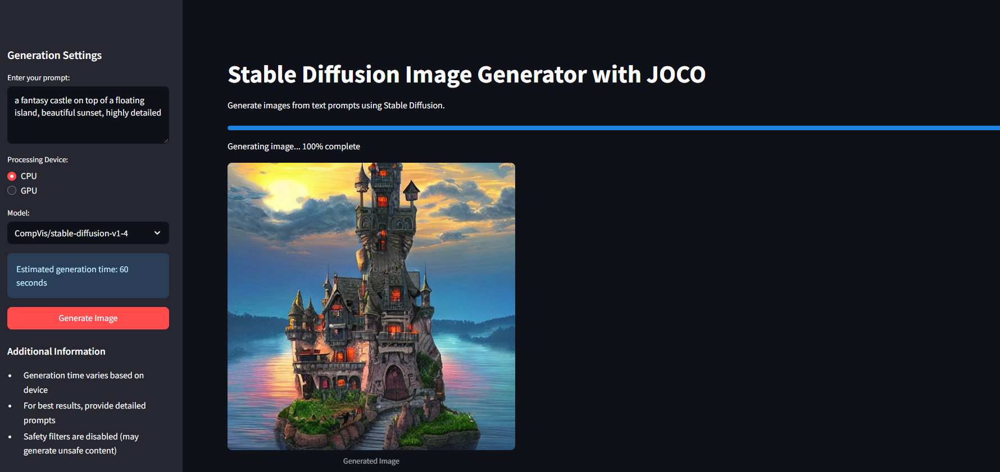

# Stable Diffusion Image Generator with JOCO



A Streamlit-based web application for generating images using Stable Diffusion. This project provides an intuitive interface for creating AI-generated images from text prompts.

## Features
- Text-to-image generation using Stable Diffusion
- Real-time progress tracking during image generation
- Support for both CPU and GPU processing
- Multiple model options
- Easy-to-use interface with Streamlit

## Requirements
- Python >= 3.11
- accelerate
- diffusers
- streamlit >= 1.45.1
- torch
- transformers

## Installation

1. (Recommended) Create and activate a virtual environment:
   ```bash
   python -m venv .venv
   source .venv/bin/activate  # On Windows: .venv\Scripts\activate
   ```

2. Install dependencies:
   ```bash
   pip install -r requirements.txt
   ```

## Usage

1. Start the Streamlit application:
   ```bash
   streamlit run app.py
   ```

2. Open your web browser and navigate to the provided local URL (typically http://localhost:8501)

3. Enter your text prompt in the sidebar
4. Choose your processing device (CPU/GPU)
5. Select a Stable Diffusion model
6. Click "Generate Image" and wait for the result

## Project Structure
- `app.py`: Main Streamlit application
- `utils.py`: Utility functions for image generation
- `pyproject.toml`: Project metadata and dependencies
- `requirements.txt`: List of Python dependencies
- `README.md`: Project documentation

## License

This project is licensed under the MIT License - see the LICENSE file for details. 